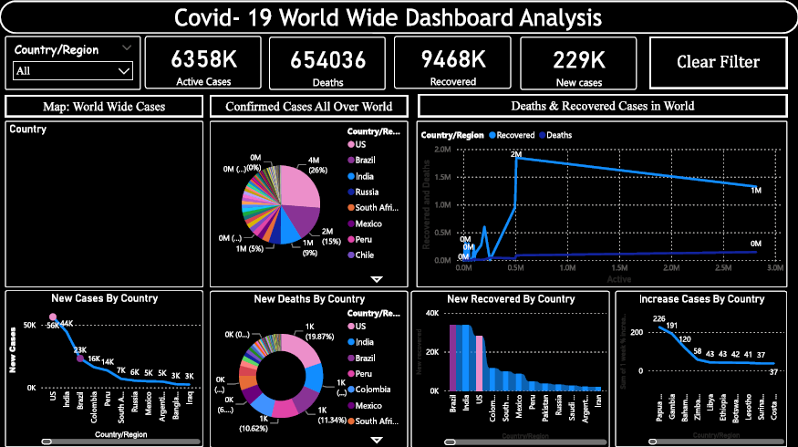

# 🦠 COVID-19 Insights Dashboard (Power BI)

## 📌 Project Overview

This dashboard visualizes global COVID-19 data to analyze infection trends, recovery rates, and country-wise comparisons.

---

## 🎯 Objective

- Track confirmed cases
- Monitor recovery & death rates
- Compare country performance
- Analyze time-based trends

---

## 🛠 Features Used

- Time-Series Visualization
- DAX Calculations
- Data Cleaning using Power Query
- Interactive Filters
- Country-wise Comparisons

---

## 📊 Dashboard Components

- Total Confirmed Cases
- Total Recoveries
- Death Rate %
- Country Ranking
- Trend Analysis

---

## 🔍 Key Insights

- Infection spikes aligned with specific time periods.
- Some countries showed faster recovery growth.
- Death rate varied significantly by region.

---

## 📷 Dashboard Preview

---

## 👨‍💻 Author
Faraz Niyazi
