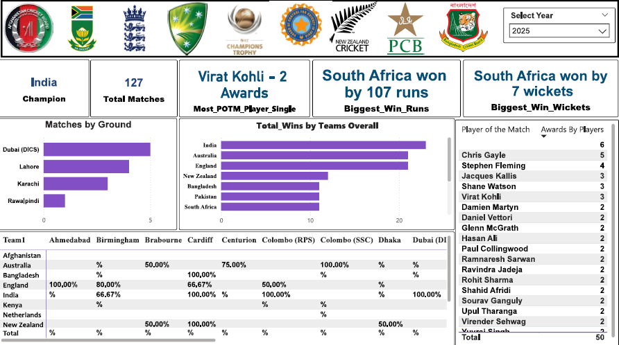

# 🏏 ICC Champions Trophy Analysis (Power BI)

## 📌 Project Overview

This dashboard analyzes ICC Champions Trophy data to evaluate team and player performance.

---

## 🎯 Business Objective

- Compare team performance
- Analyze player statistics
- Track match outcomes
- Identify top performers

---

## 🛠 Power BI Techniques Used

- Data Modeling
- DAX Calculations
- Ranking Measures
- Interactive Filters

---

## 📊 Dashboard Features

- Team-wise Win Analysis
- Player Performance Metrics
- Match Statistics
- Tournament Trends

---

## 🔍 Key Insights

- Certain teams dominated tournament performance.
- Key players significantly influenced match outcomes.
- Batting average strongly correlated with match wins.

---

## 📷 Dashboard Preview

---

## 👨‍💻 Author
Faraz Niyazi
