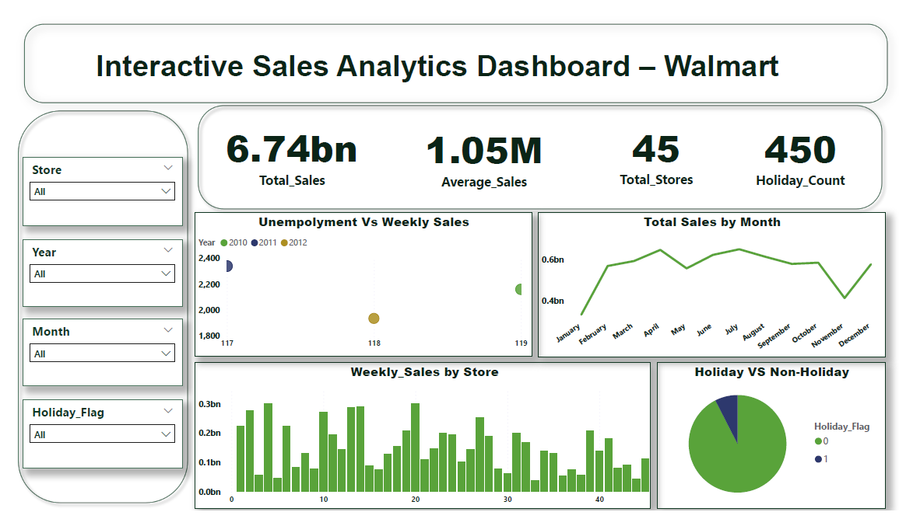

# 🛍 Walmart Sales Analysis Dashboard (Power BI)

## 📌 Project Overview

This project analyzes Walmart retail sales data to monitor revenue, profit, and product performance.

The dashboard provides interactive filtering and KPI tracking for business decision-making.

---

## 🎯 Business Objective

- Track total Sales and Profit
- Analyze Category & Sub-Category performance
- Identify high-performing Regions
- Monitor monthly trends

---

## 🗂 Dataset Details

- Order ID
- Order Date
- Product Category
- Sales
- Profit
- Region
- Customer Segment

---

## 🛠 Power BI Features Used

- Star Schema Data Modeling
- DAX Measures (Total Sales, Total Profit, Profit Margin)
- Slicers & Filters
- KPI Cards
- Time-Series Analysis

---

## 📊 Dashboard Components

- Total Sales KPI
- Total Profit KPI
- Sales by Region
- Category Contribution
- Monthly Sales Trend
- Profit Margin Analysis

---

## 🔍 Key Insights

- Certain regions contributed significantly higher profit margins.
- Technology category generated highest revenue.
- Seasonal spikes observed in Q4.
- Some sub-categories had high sales but low profit margins.

---

## 📷 Dashboard Preview

---

## 📈 Business Impact

Helps management:
- Identify profitable categories
- Optimize product strategy
- Improve regional targeting
- Monitor performance trends

---

## 👨‍💻 Author
Faraz Niyazi
